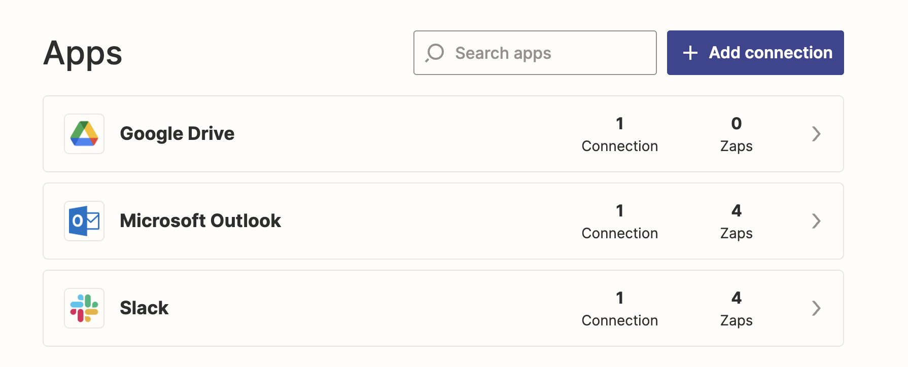

# Abusing exisitng [Zapier](https://zapier.com) OAuth integrations

In the example below, a Zapier user has set up connections to Google Drive, Microsoft Outlook and Slack. An adversary gaining control of this Zapier account could gain access to data in these apps using these integrations.

Given the power and flexibility of an app like Zapier, this would allow almost total control of these accounts. For example, it would be possible to continuously read/write files from Google Drive at will, send/receive/modify email in Microsoft Outlook and read and send Slack messages as the user.

