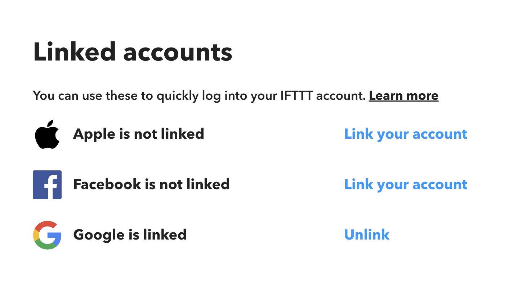

# Account ambushing on IFTTT

A user can sign up using any email address and then link Apple, Facebook, and Google social accounts to the account to backdoor access. If the real owner of the email address attempts to register, they will be forced to perform a password reset to gain access, but the app will not unlink the social accounts linked previously.

The process resembles the following:
1. Register an account for victim@target.com using a password login
1. Link the account to an Apple or Facebook account
1. Target attempts sign up and is forced to reset their password in order to gain access
1. Target begins using account, configures connections to other apps
1. Adversary authenticates to the target’s account using the Apple or Facebook account

