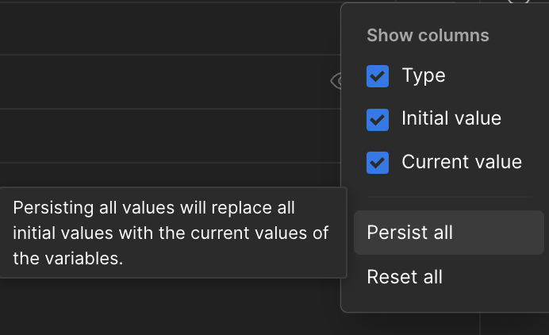
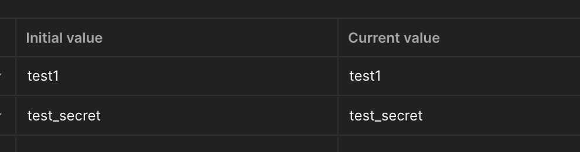

# Postman

Postman is a great example of an app that stores API secrets for other apps. While it does have functionality and guidance for how to securely manage secrets, it is very common for API secrets to end up embedded directly into API requests or persisted (intentionally or accidentally) via the built-in Postman functionality for managing variables.

An insecurely stored API call may look something like the following, where the API key has been embedded directly into the request:

```
GET /api-call/method1?api_key=mysecretapikeyhere
```

On the other hand, the secure way to manage secrets is to use  variables with initial and current values, where the initial value is not sensitive. However, if a real API secret is stored in an initial value, the secrets are accessible to an adversary with Postman access.



