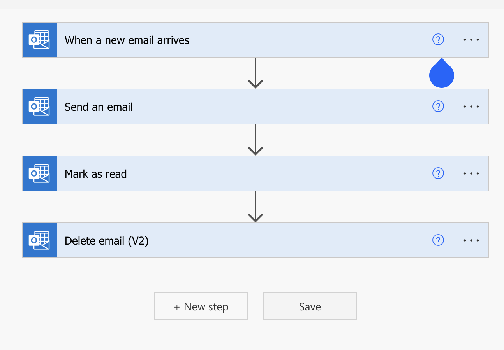
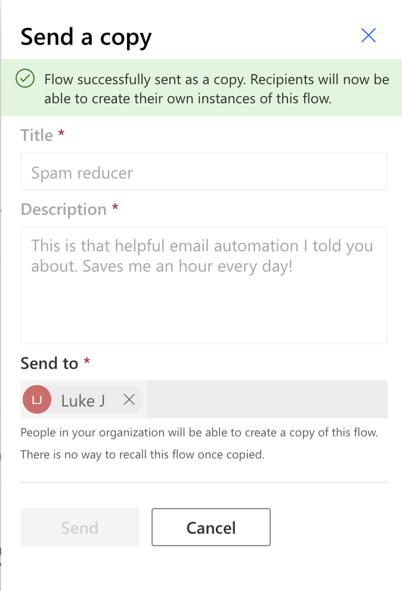
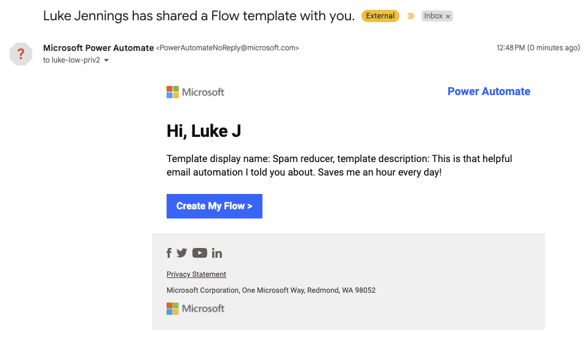
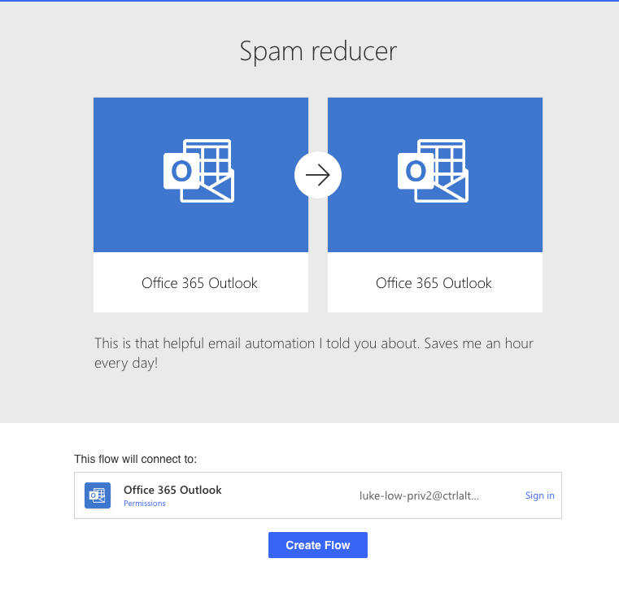
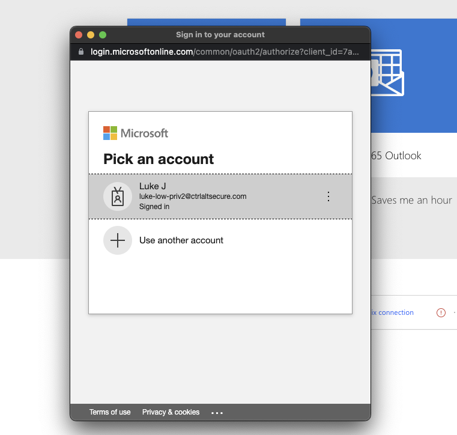
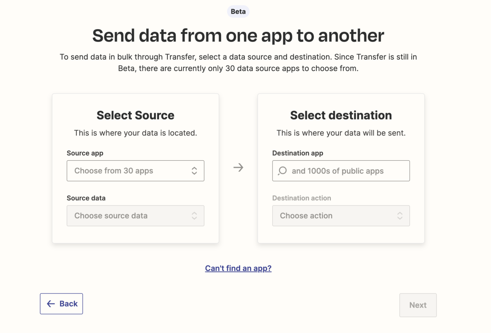
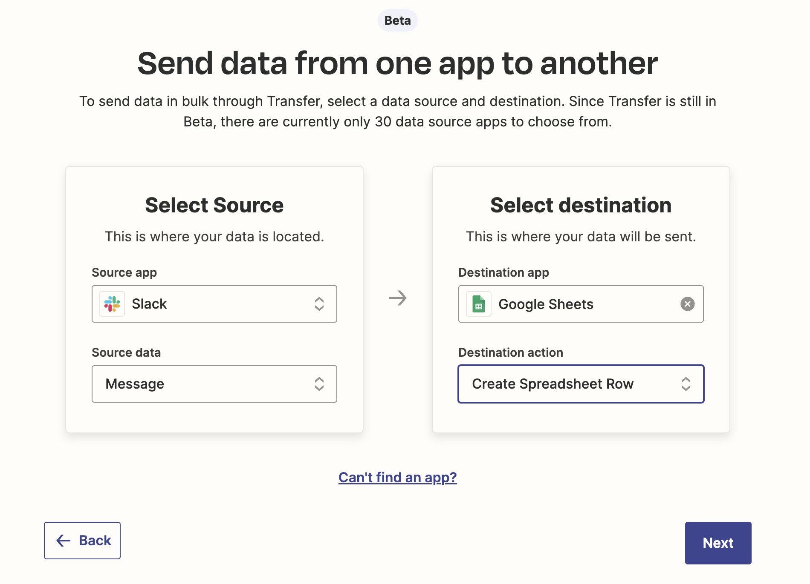

# Microsoft Power Automate

Microsoft Power Automate is a great example of this as it has functionality to “Send a copy” of an automated flow. This is only permitted for other users in your tenant, so it requires a foothold into the environment first.

However, the example below demonstrates creating an automation that replicates malicious mail rule functionality. The automation  forwards emails to an external address and then deletes the emails under certain conditions e.g. security alerts/password resets.

Sending this to another user results in an email being sent to that user by the Microsoft Power Automate app. If they are already a user then it is one click from the email and one more click to create the flow and then it is operating. If they aren’t already a user and do not have an outlook connection setup then it will prompt them to click to sign-in to create the connection first and then will create the flow.

