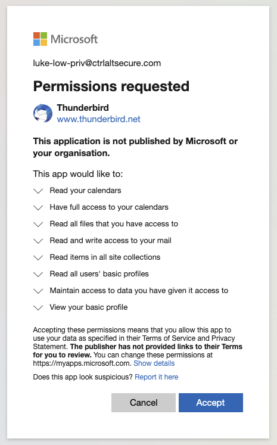

# Spoofing thunderbird desktop client

There are many examples of this as it applies to a whole class of OAuth authentication. One example would be Mozilla Thunderbird, a cross-platform email client. In this case, Thunderbird uses an embedded client secret for its OAuth integration. An adversary can reuse this for persistence, and even request access to a number of additional permissions (for example file access) beyond typical email and calendar access, as shown below:

