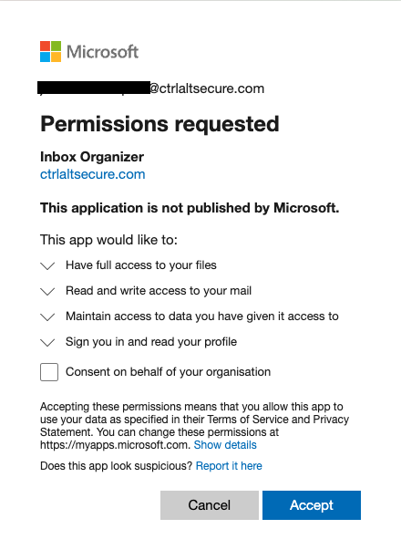

# Consent phishing on Microsoft

An example of a consent screen showing for Microsoft Azure and requesting full access to read email and all files is shown below:

If a target were to click the accept button then the attack would be successful and the attacker would gain those permissions until explicit action was taken to revoke the access.
