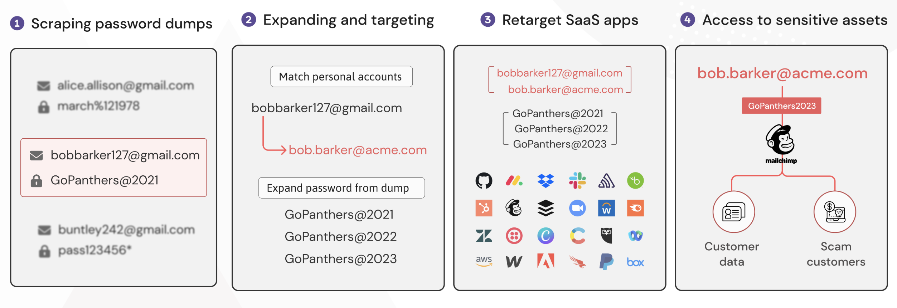

# Credential stuffing

## Tactics
* Initial Access

## Summary
Credential stuffing is the re-use of stolen credentials, often from leaked password databases, in an attempt to authenticate to other apps. This is often successful due to the tendency of users to share passwords between multiple systems and accounts.

This can be particularly effective against heavy users of SaaS apps as the higher the number of systems in use, the greater the chance that a compromised password hasn’t been changed.

These attacks can be make more effective by matching personal and corporate email addresses, as well as guessing likely similar/incremental passwords.

## Examples

## References

* [MITRE - Brute Froce: Credential Stuffing](https://attack.mitre.org/techniques/T1110/004/)
