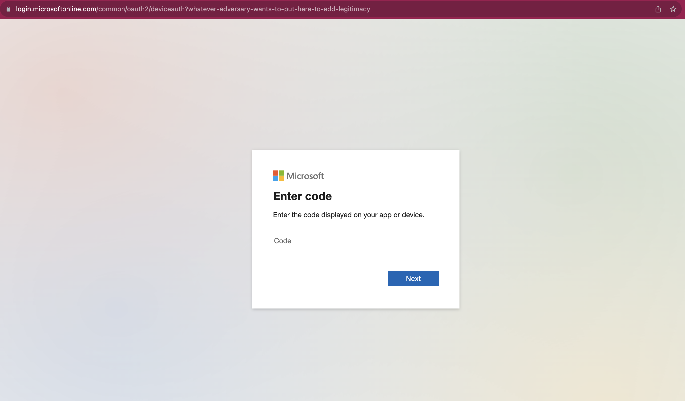
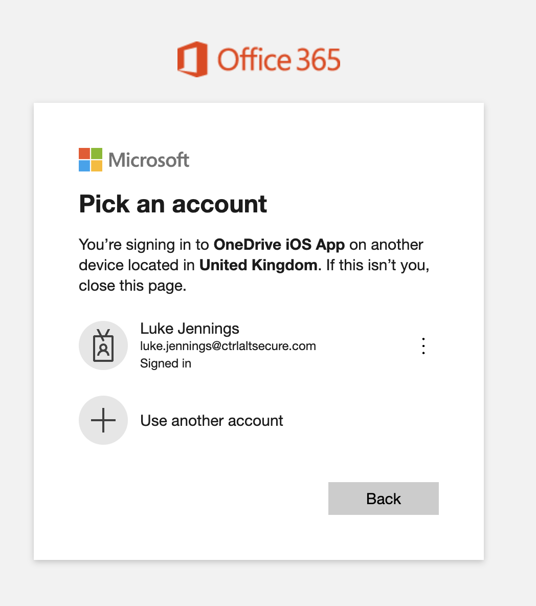
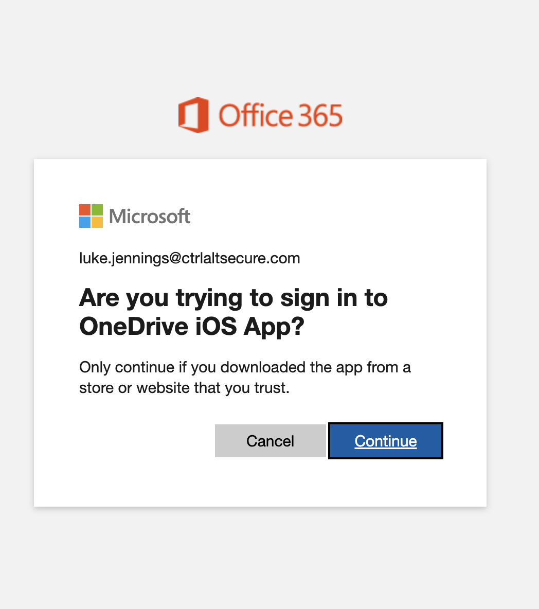

# Device code phishing with Microsoft

The target is encouraged to visit the following link and enter a device code supplied by the adversary. In this example, the OneDrive iOS app is spoofed:

https://microsoft.com/devicelogin?whatever-adversary-wants-to-put-here-to-add-legitimacy

