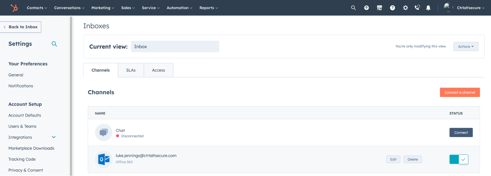
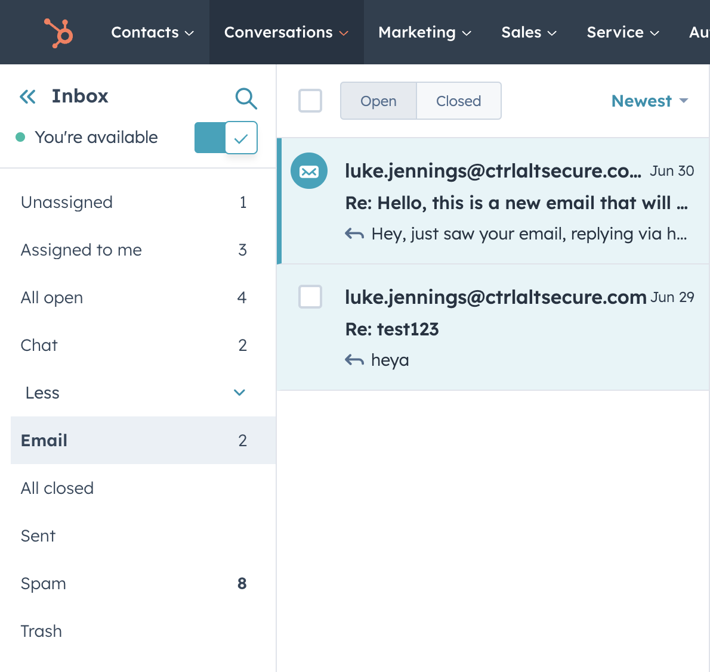

# Hubspot for email access

Hubspot is a marketing automation app that allows users to connect up an email account to the app. This is a legitimate and verified OAuth integration created by Hubspot. While the adversary does not have access to the OAuth access tokens, they can make indirect use via the functionality available in their Hubspot account.

In this case, Hubspot has functionality to act like an actual email inbox,so it acts like a lightweight webmail solution. This provides adversaries backdoor-like access to the account’s email, while masquerading as Hubspot.

