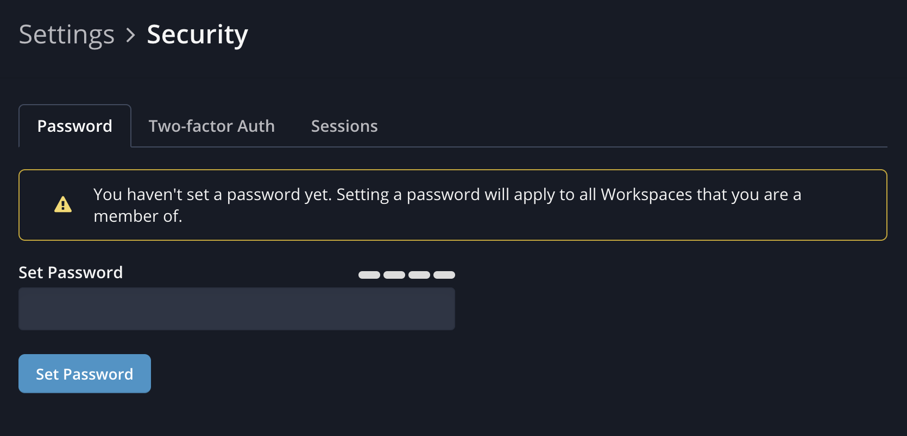

# [Shortcut](shortcut.com)

A user may set a Google OIDC social login and set a separate password disconnected from the Google account and login with either. The following is a screenshot of a user logged in with a social login setting a password as well:

