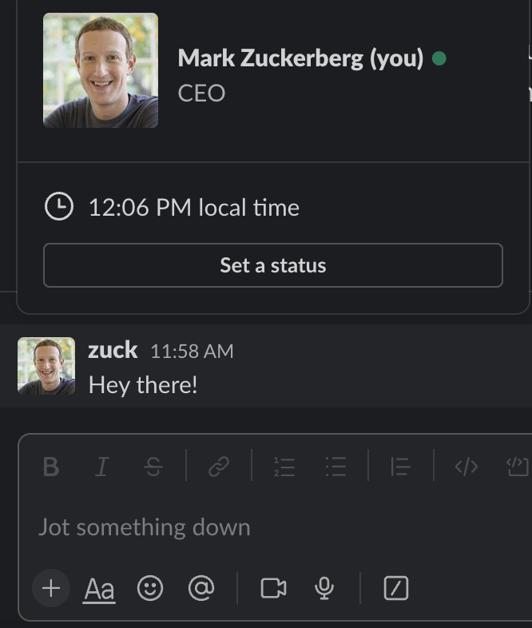

# Slack

* [Slack Attack: A phisher's guide to initial access](https://pushsecurity.com/blog/slack-phishing-for-initial-access/)
* [Slack Attack: A phisher's guide to persistence and lateral movement](https://pushsecurity.com/blog/phishing-slack-persistence/)

Slack is a great example of this, since users control almost all of their details by default. You can even pick a Slack handle that existing users are already using, so you could pick the exact same handle as the CEO or whatever employee you would like to impersonate.

In an external Slack phishing scenario, you can also control these details and additionally pick your workspace name and logo to replicate the organization you want to spoof.

