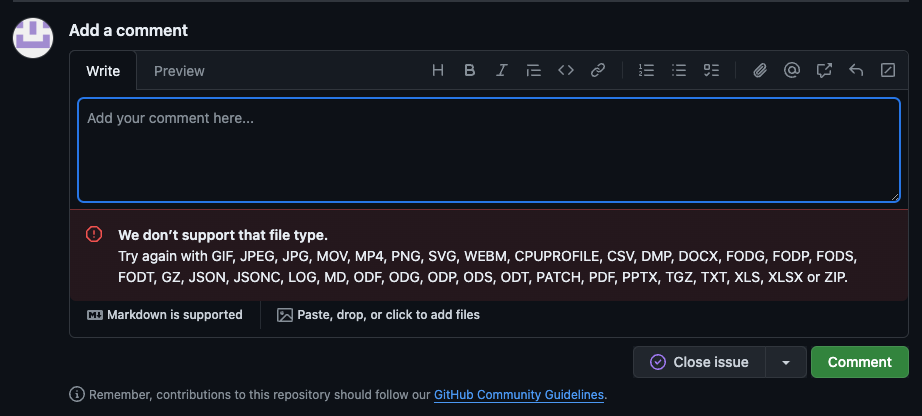

# GitHub

GitHub is an example of a SaaS app that supports links in a variety of locations that can be used for phishing. These do not have to be associated only with repositories that an attacker controls as it's common for issues, discussions and comments on public repositories to be usable by any GitHub user.

However, one particularly interesting trick afforded to attackers with GitHub is the ability to host a range of file types in URLs for repositories they do not control without the owners even being notified.

It's possible to upload a file to a GitHub comment and it will automatically be hosted on a URL associated with the given repository and organization. This occurs without even posting the comment while it's still in draft, and the link persists even if the comment is not posted. This enables malicious files to be spread using GitHub URLs that are additionally associated with well-known organizations and repositories, such as Microsoft themselves.

For example, the image below shows the supported file formats in the error:

This image shows the link being created while the comment is still in draft and providing a link to the file both within the "pushsecurity" organization and within the "saas-attacks" repository

For further details, checkout the following article:

https://www.bleepingcomputer.com/news/security/github-comments-abused-to-push-malware-via-microsoft-repo-urls/