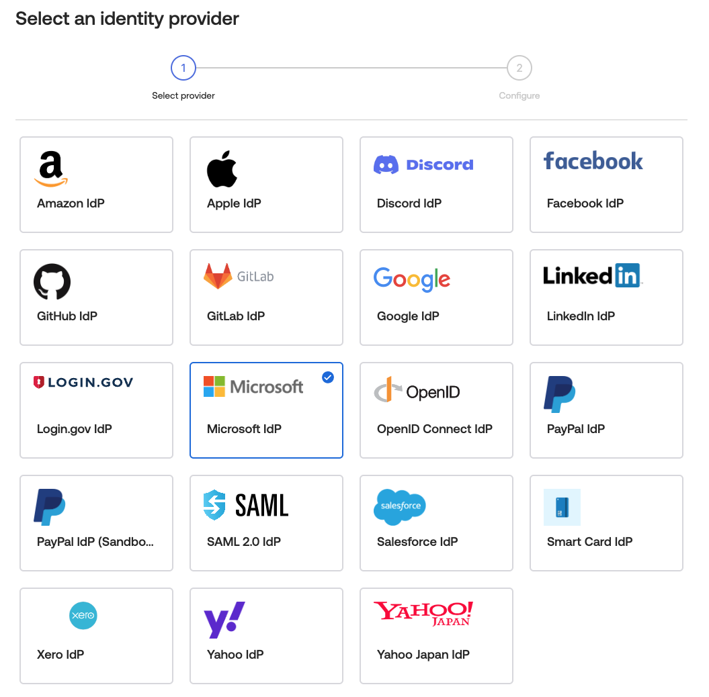
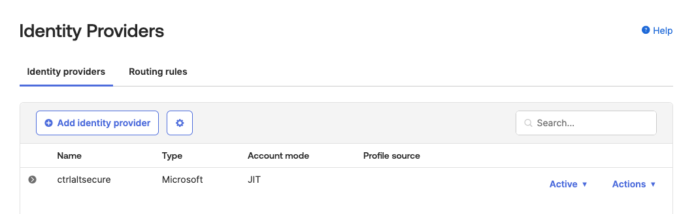
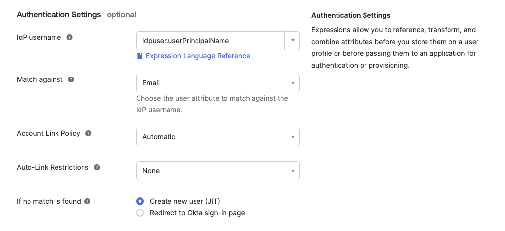

# Okta Inbound Federation

Okta is one example of an identity provider that allows external identity providers to be configured for inbound federation. Combined with automatic account linking, this can be used to configure a downstream identity provider that the adversary controls, which can then be used like a skeleton key to authenticate as any Okta account the attacker chooses.

Given Okta is an identity management service that allows users access to other applications, this would allow an adversary to easily impersonate any Okta user and then laterally move to other applications.

This has been observed in real-world compromises of Okta customers as highlighted in the following article published by Okta:

https://sec.okta.com/articles/2023/08/cross-tenant-impersonation-prevention-and-detection

The following screenshots show some of the options for configuring inbound federation using external identity providers, including automatically linking them to pre-existing Okta accounts:

