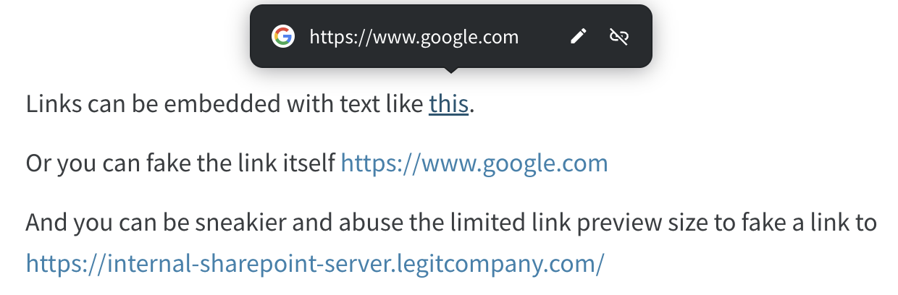
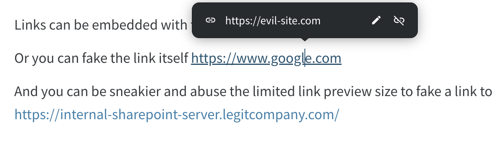
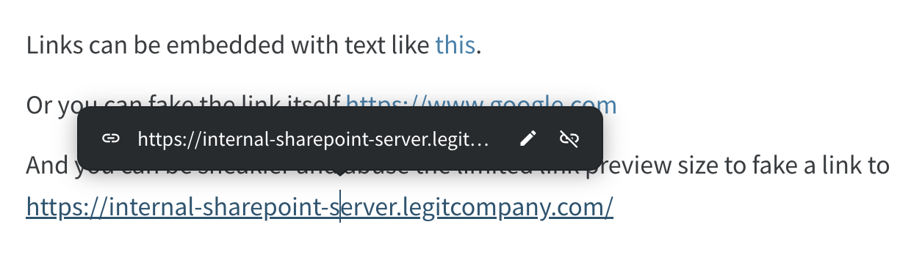

# Backdooring links on [Nuclino]](https://nuclino.com/)

Nuclino, a SaaS-based wiki, is a great example of a target for URL/link backdooring. By default, all users have read/write access to everything in their workspaces. In practice, that means any single compromised user has the ability to modify a large amount of content.

Additionally, Nuclino has an API, making it very easy for an adversary to automate the process of backdooring all links or applying some selection criteria.

Worse, since Nuclino is a trusted system, there is very little link security. The links are not automatically analyzed and reported on and there are multiple ways to obfuscate them. Many users may choose to ctrl+click on links so they never see the real link by hovering over it. This means you can easily hide links as normal text or by obfuscating one link as another, in ways that mail servers would normally alert on.

Even if users are clicking on links to see the link preview and are manually verifying the URL seems legit, it’s still possible to take advantage of the limited space available for a preview to hide the real domain and make use of subdomains to make it seem like the URL matches.

The link preview above masks the fact that the real URL is the following:

`https://internal-sharepoint-server.legitcompany.com.myevildomain.com/`