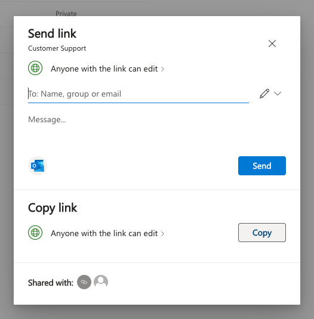
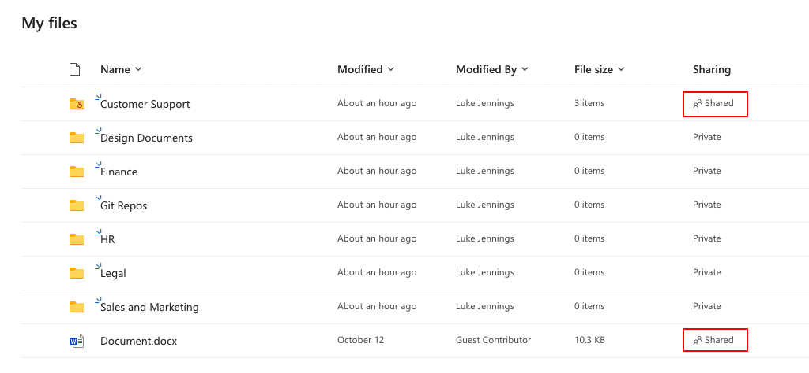

# Public sharing in OneDrive

Given below is an example of sharing links in OneDrive. Documents and folders can either be shared with named external users in other OneDrive tenants or an anonymous link can be copied and distributed.

In this case, sharing a root level folder means access can be maintained to all future documents and subfolders that are added to it. Shared items are clearly marked when browsing OneDrive but that isn’t always the case across SaaS apps.

