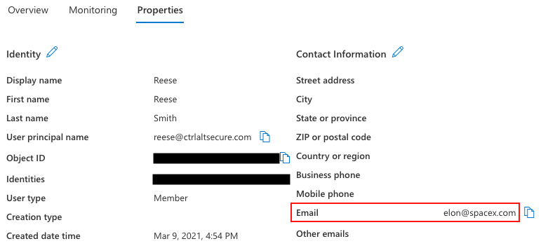

# nOAuth attack on AzureAD

Changing the email address of a user to one not belonging to the tenant is trivial in Microsoft Azure. The image below shows a spoofed email configured for the user account.

