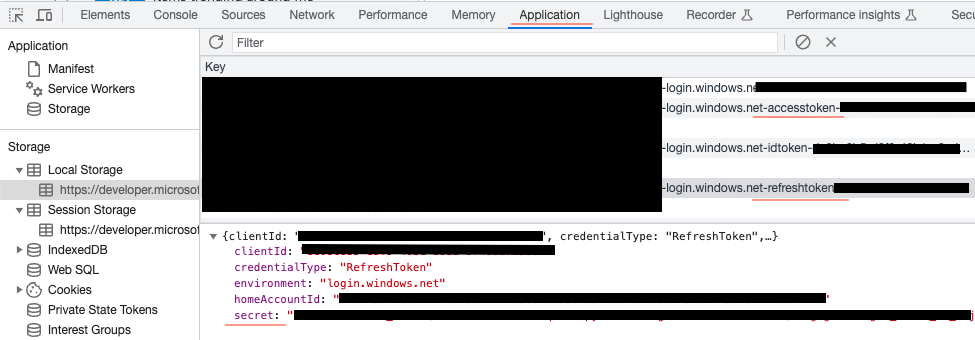

# Create refresh token with Microsoft Graph Explorer

Graph Explorer is typically used to test queries and Graph-related functionality within Azure tenants. If an adversary gained access to a user’s credentials, they could create a refresh token by signing into Graph Explorer and extracting the token from the browser’s local storage:

It would be equally simple to create a custom Graph API client using the Microsoft SDKs, but this method requires zero custom code and looks like a legitimate Microsoft app (because it is).