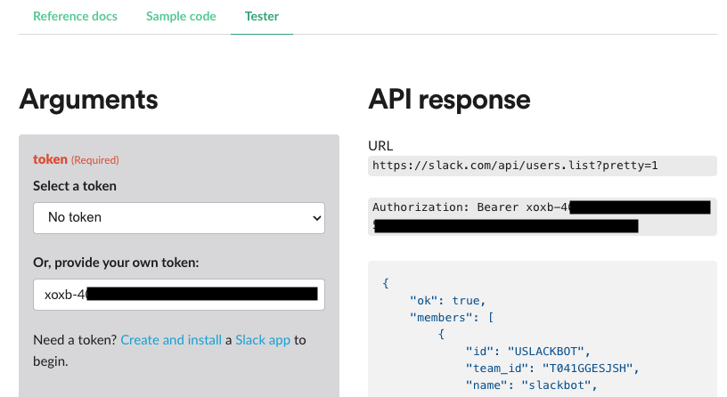

# Make API calls using the Slack API tester

The Slack API Tester can be used to test different API calls, such as retrieving user listings, posting messages to channels or via DM, and even assigning administrator privileges to accounts, depending on the Slack tenant’s licensing level.

A bot token is required, which can be created and installed to Slack instances by default by any user. With this in hand, any supported API call can be used without raising suspicion.

