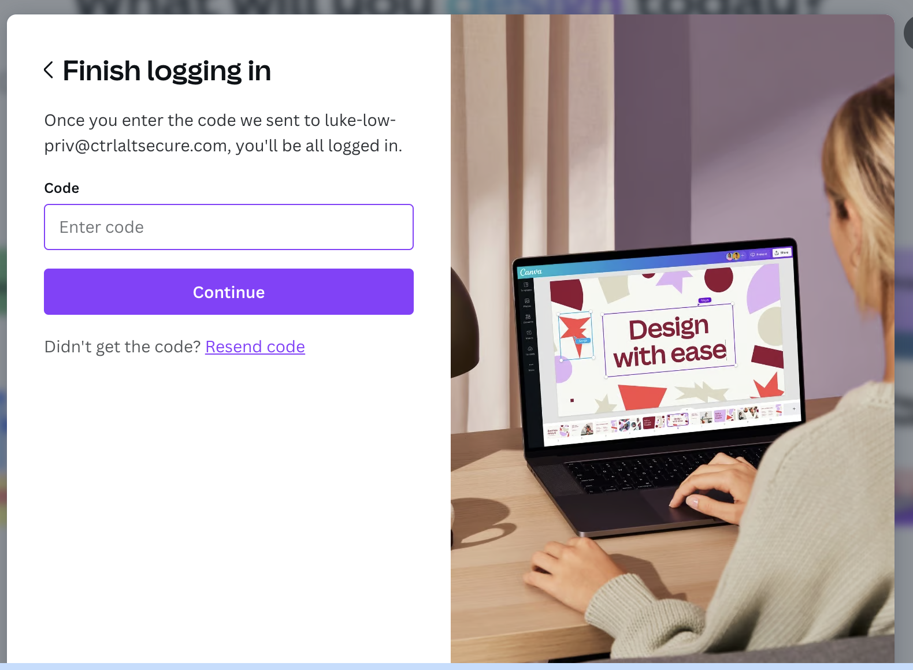
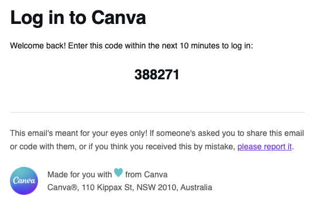

# Canva

Canva is one example of a popular SaaS app that defaults to email-based passwordless authentication for accounts. An adversary with email access would be able to move laterally to this system by triggering the login process and accessing the resultant email.

