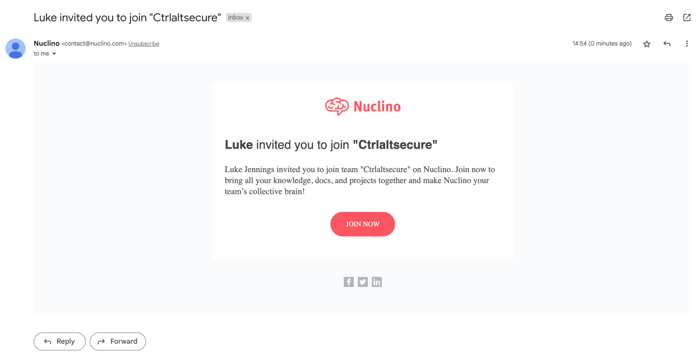
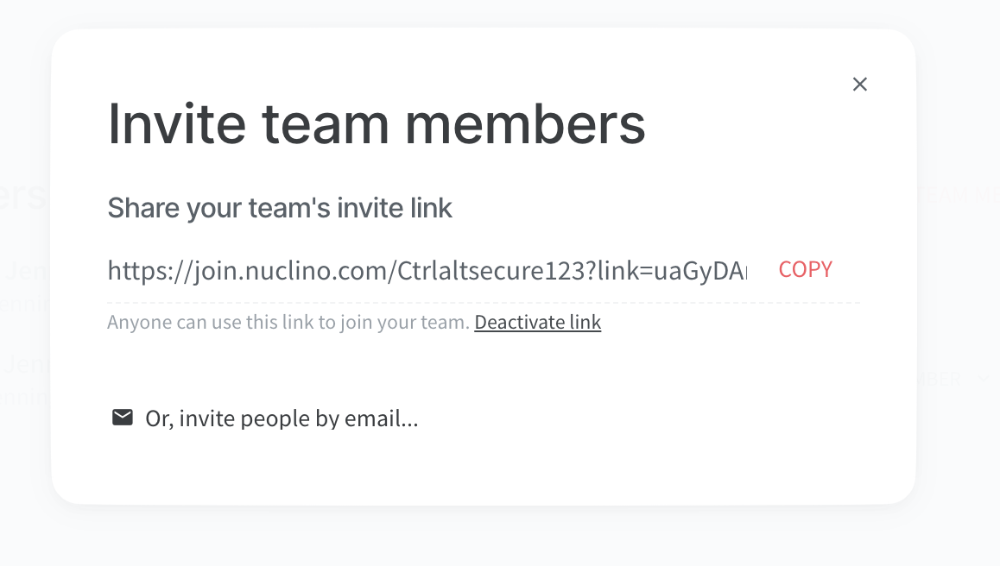
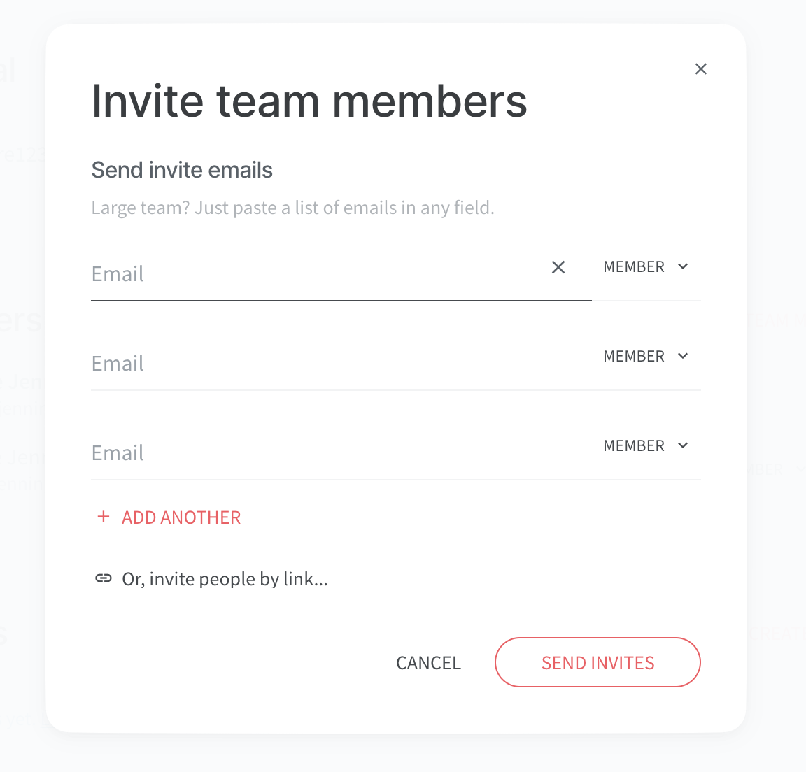

# Poisoned tenant invite for Nuclino

Nuclino lets you invite users by email or by sending sharing links. The invite emails Nuclino sends also do not show the email address of the adversary, only their display name, which is great for social engineering.

