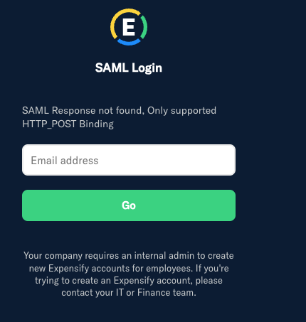
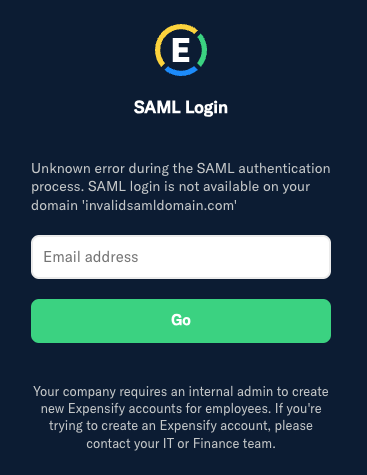
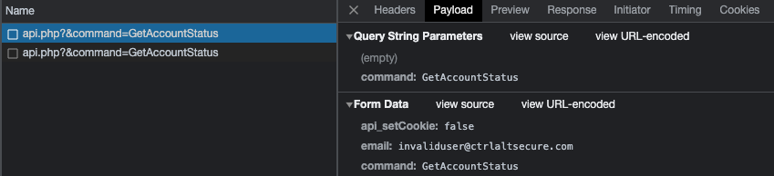

# SAML enumeration on [Expensify](https://expensify.com)

There are at least two places that you can enumerate SAML configuration within Expensify.

## SAML configured login page

If you make a GET request to the SAML login callback method, the friendly error message will be different depending on if it is a domain that has SAML authentication configured or not.

https://www.expensify.com/authentication/saml/loginCallback?domain=ctrlaltsecure.com

### Valid SAML domain

### Invalid SAML domain

## Login page

When attempting an email based login, the details that come back indicate whether SAML is supported for the email domain, even if the specific email address is not in use.

