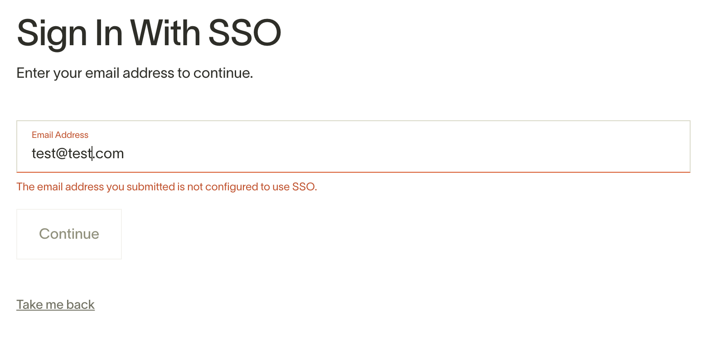
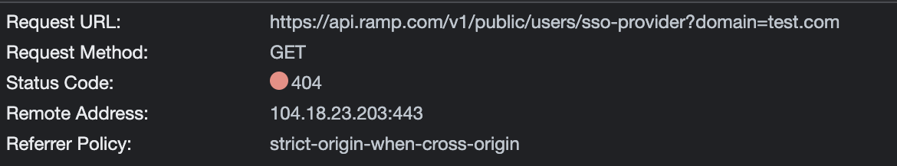
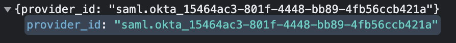

# SAML enumeration on [Ramp](https://ramp.com)

Ramp provides the ability to login via username/password, via Google social login or via SSO. If you login via SSO, the app will use the domain associated with the email in order to map to the correct SSO provider.

In the instances below, note the difference between using a test domain that does not have SSO configured and using the domain for an organization that configured SSO authentication via Okta.

