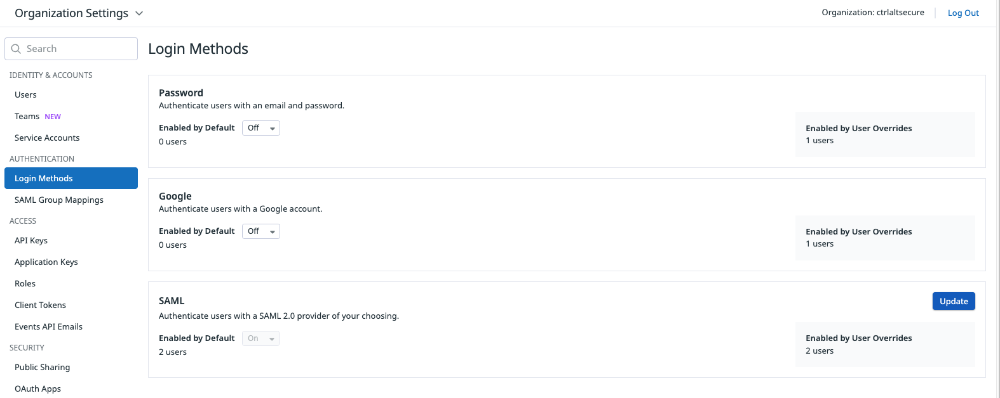
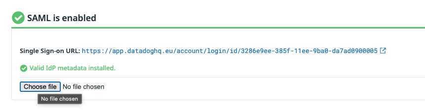
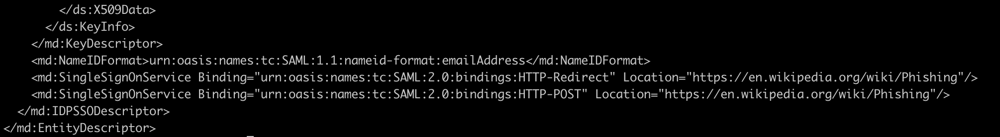

# SAMLjacking on [Datadog](https://https://www.datadoghq.com/)

Datadog allows SAML integrations even on their free tier, so makes a great test case.

Datadog requires you to upload a metadata XML file, rather than fill in individual field. This is available as a download option for common SAML providers like Google.

Any redirection URLs can be given in this file to direct a target to whatever phishing URL the adversary would like. In this case, we are just showing a test of directing a target to the wikipedia page for phishing.

A unique organization login URL will be given by Datadog that then immediately redirects to the configured URL when visited.

https://app.datadoghq.eu/account/login/id/3286e9ee-385f-11ee-9ba0-da7ad0900005
