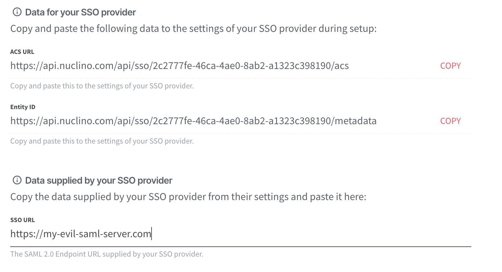
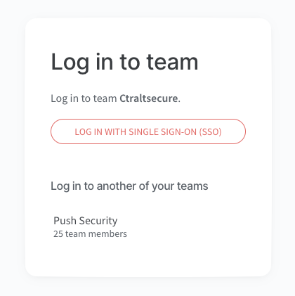
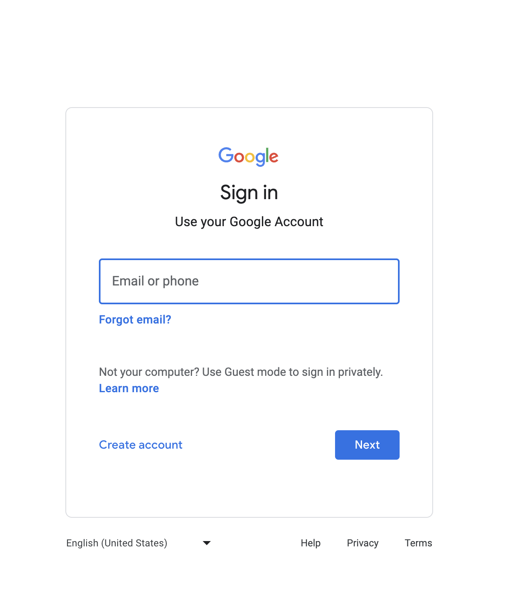

# SAMLjacking on [Nuclino](https://nuclino.com/)

Nuclino allows SAML integrations even on their free tier, so makes a great test case. This is the SAML configuration page (showing the SSO URL):

The adversary could set the tenant name to match the target (e.g “Ctrlaltsecure” targeting ctrlaltsecure.com):
 https://app.nuclino.com/Ctrlaltsecure

The target would then see this legitimate login page:

When clicking login, the user would be redirected to a legitimate-looking phishing page:

A demo video of an attack chain combining SAMLjacking with a poisoned tenant using Nuclino is given below:
 
