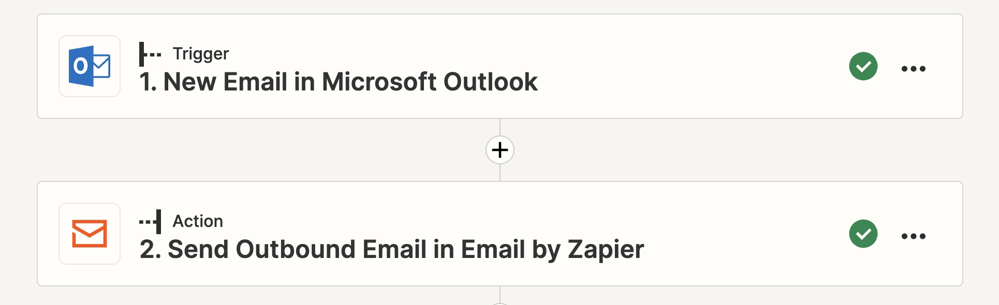
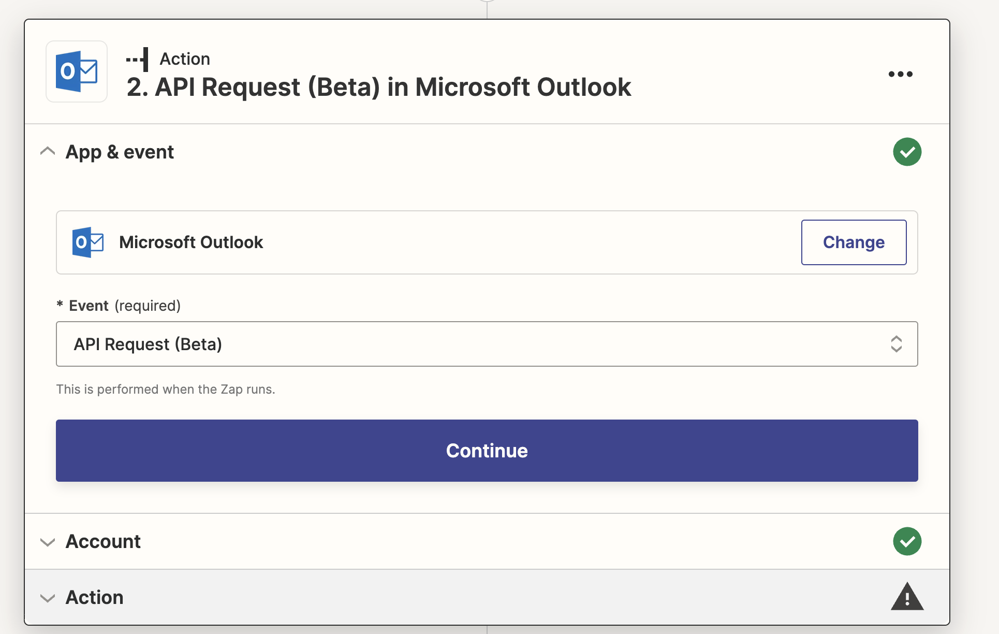

# Shadow workflow with Zapier to forward and delete account recovery emails

While the possibilities are nearly endless, one example would be replicating malicious mail rules via an automation app. The screenshots below show how an adversary could use Zapier automations to capture emails and delete them if they contain keywords such as “password reset”.

