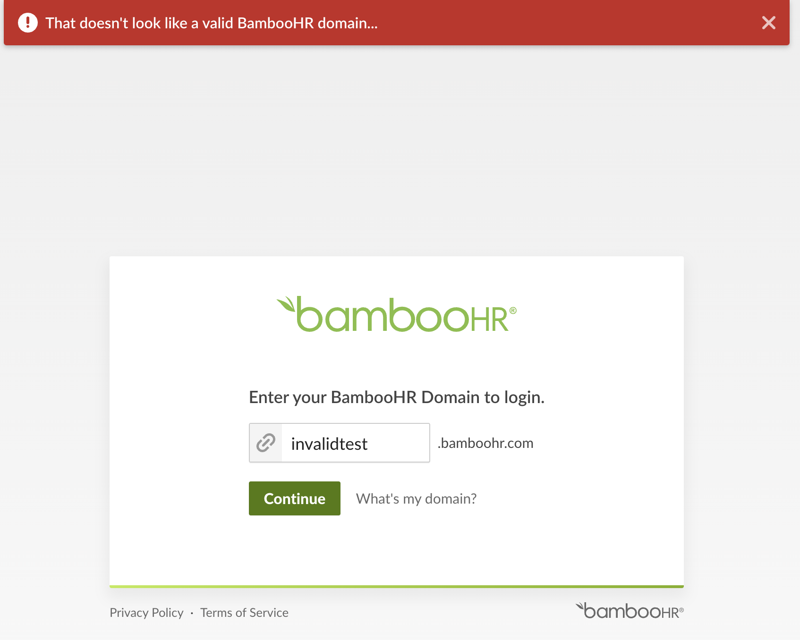
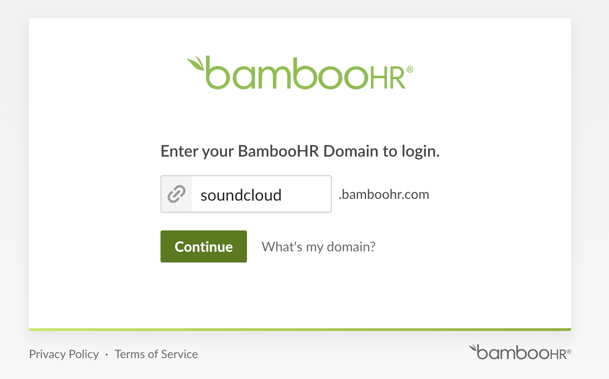
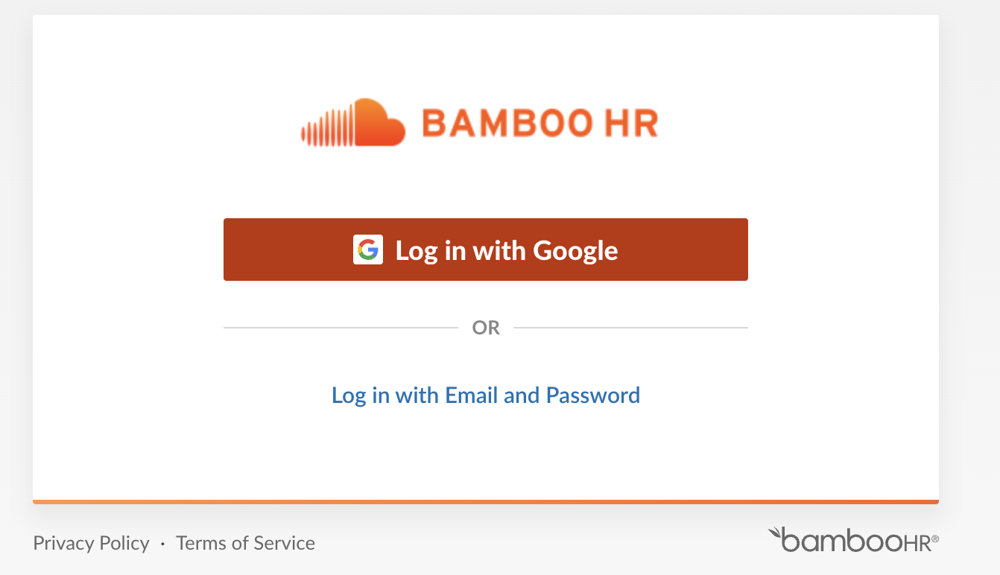

# SSlug tenant enumeration on [BambooHR](https://www.bamboohr.com/)

This issue is present within the login process where it asks for the BambooHR tenant name in order to direct to the correct login page. This results in background requests that can be used to determine if a name is already taken or not:

```
% curl -XGET "https://app.bamboohr.com/ajax/domain.php?test=invalidcustomer"
{"taken":false}%
% curl -XGET "https://app.bamboohr.com/ajax/domain.php?test=soundcloud"
{"taken":true}%
```



