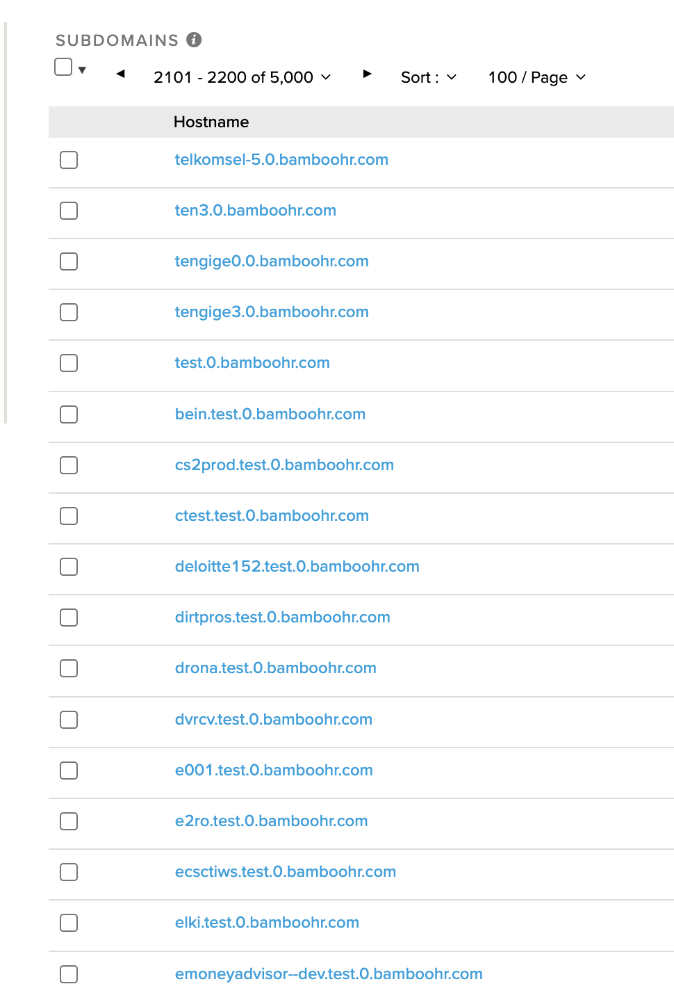

# Subdomain discovery on [BambooHR](https://www.bamboohr.com/)

Using passive DNS discovery tools we can see valid subdomains, many of which correspond to BambooHR tenants. The screenshot below shows a small fraction of approximately 15,000 subdomains observed in one passive DNS source:

