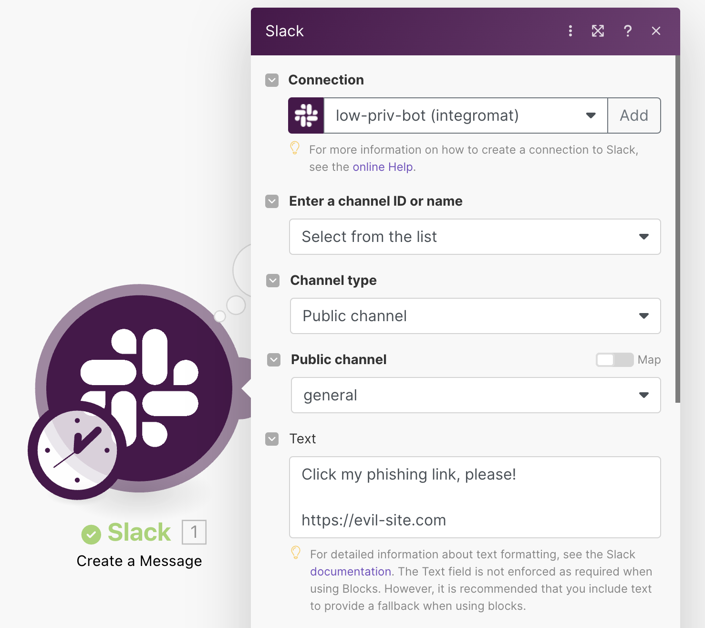
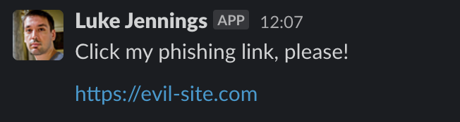
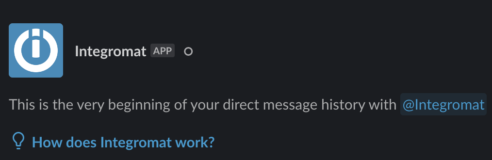

# Slack

* [Slack Attack: A phisher's guide to persistence and lateral movement](https://pushsecurity.com/blog/phishing-slack-persistence/)

Slack is a great example of this as it permits standard users to add app integrations by default. Worse, it also separates OAuth tokens for apps into user tokens and bot tokens. User tokens are tied to the user account and become invalidated when a user account is disabled. However, bot tokens are tied to the app, so they persist even when the original user account is disabled.

For example, the automation app Make.com can be integrated with Slack by a standard user, which then provides access to the user and bot tokens separately. This means that Make.com can be used to perform actions on Slack – such as messaging users with phishing links. These actions are detached from the original user account and continue to operate after the account is disabled.

Make.com, like many automation apps, also allows you to fully customize the name and icon for the bot when messaging, making it useful for impersonation. The only giveaway is the “APP” tag after the account and if you click on the user it takes you to the Make.com bot account instead (Integromat, from a former merger).

