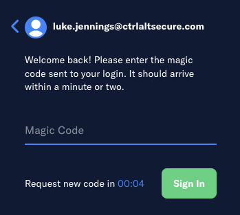
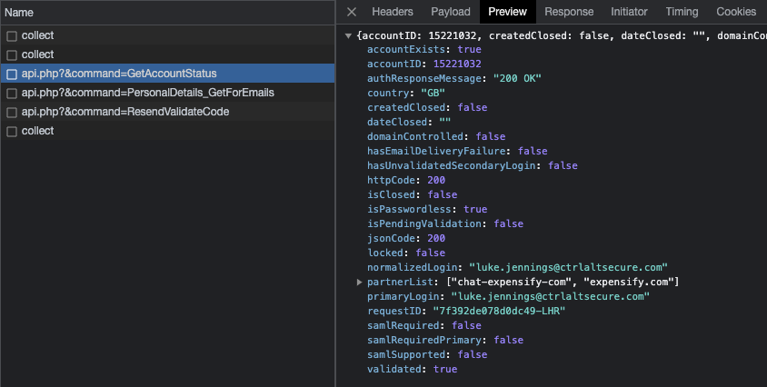

# Username enumeration on [Expensify](https://www.expensify.com/)

When attempting to authenticate to Expensify, a request to validate the account is made. This is also linked to the default authentication mechanism being passwordless logins via email. Consequently, whether the account is valid or not is indicated.

