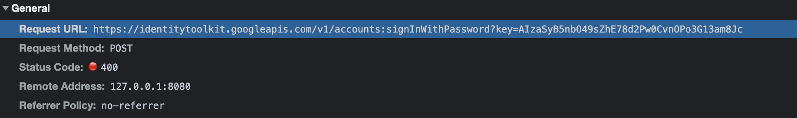
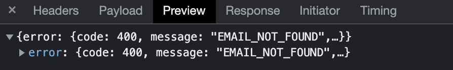
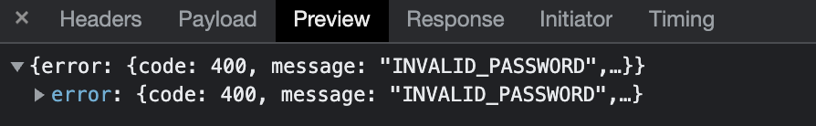

# User enumeration on [Ramp](https://ramp.com)

When attempting to authenticate to Ramp, a request is made on the backend using Google’s Identity Toolkit, which indicates whether the email address is a valid account:

